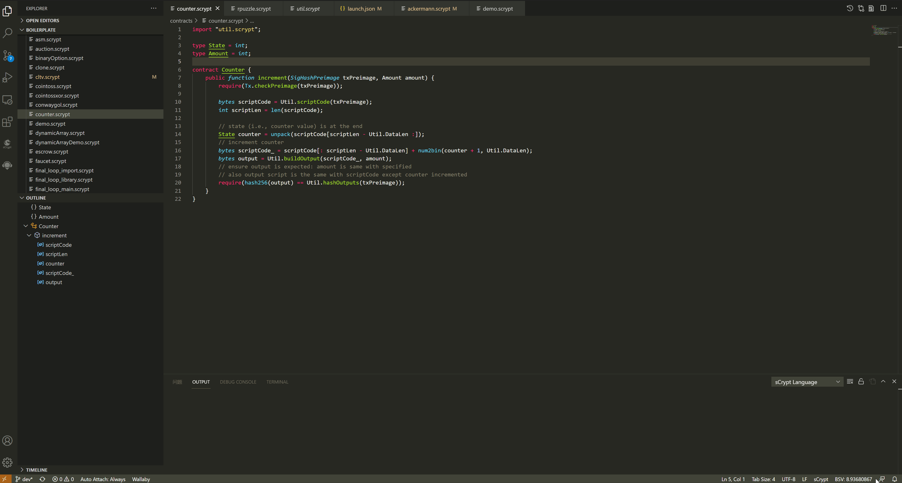

.. _compiling:

===========================================
编译
===========================================

自动编译
===============

每次修改代码，**IDE** 都会重新编译代码，同时也会监听文件系统。如果当前打开的文件依赖的文件被删除，也会重新编译代码。

手动编译
===============
**IDE** 支持在代码编辑器/资源管理器上下文菜单中编译合约文件。

编译完成后，在VS Code 窗口的右下角会有 **通知** ，同时 **输出面板** 也会输出编译结果，包括编译的合约文件名，编译出来的脚本大小 [1]_， 合约描述文件存放路径。

.. _contractdescription:

合约描述文件
===========================================

合约描述文件是编译合约的输出结果，可用于测试、部署、调用和集成合约。

.. hint::
    `scryptlib`_ 文档有关于 **合约描述文件** 的详细介绍。

.. _debug_compiling:

调试编译
===========================================

*在代码编辑器上右键单击，选择* : ``Compile Contract : Debug``

在开发过程中主要使用调试编译来构建合约，包括调试器、单元测试，甚至部署调用合约也可以使用此构建类型。在该构建类型下，
编译器生成的脚本不包含优化，包含辅助信息，可以用于调试和定位异常。

.. _release_compiling:

发布编译
===========================================

*在代码编辑器上右键单击，选择* : ``Compile Contract : Release``

当一切准备就绪之后，应该使用发布编译来构建合约。在该构建类型下，
编译器会 :ref:`生成优化 <optimize>` 的脚本，删除辅助信息，从而使脚本会变得更小，节省交易手续费。
目前只有付费用户才能使用此功能，请参阅 :ref:`高级付费功能 <premium>`

.. warning::

    不版本的编译器编译出来的脚本可能会不一样，但是它们是等价的。如果编译出来的脚本发生变化，通常会导致旧的的 **交易原象** 无法校验通过，通过计算一个新的 **交易原象** 即可修复此问题。

.. [1] 改大小计算方式不包含合约构造函数参数

.. _desc: https://gist.github.com/zhfnjust/026f9f4612693afc73d7e211f1a7d3f1

.. _VERSIONLOG: https://github.com/sCrypt-Inc/scryptlib/blob/master/VERSIONLOG.md

.. _scryptlib: https://github.com/sCrypt-Inc/scryptlib