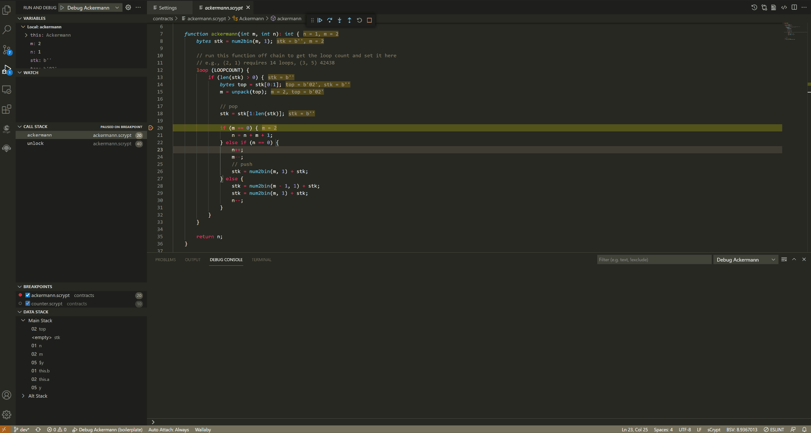

.. _debugger:

===========================================
调试器
===========================================

**IDE** 自带一个功能强大的调试器。可以用它来调试 ``.scrypt`` 源代码。如果购买了高级付费功能，还可以用它来进行脚本级别的调试。
并非所有合约都可以编写完成后就会按照预期行事，当它发生错误时，可能需要盯着代码看好几个小时，一个好调试器可以让你更轻松且更高效地解决问题。
当调试合约时，调试器提供许多方法让你查看代码的情况，比如逐步执行代码、查看变量中存储的值、查看函数的调用栈、查看比特币双堆栈中的数据、代码的执行路径等。

配置启动参数
======================

与一般语言（比如C++/Javascript)不同， 启动 **IDE** 的 debugger 必须配置启动参数。这是 **sCrypt** 语言的结构特性决定的，如下图：
我们知道比特币脚本的执行是将解锁脚本和锁定脚本连接起来形成完整的脚本后再执行， 其中解锁脚本在前，锁定脚本在后。
**sCrypt** 合约含有一个或者多个 *public* 函数， 启动调试器就是运行合约的某一个 *public* 函数，函数的参数对应解锁脚本， 函数的内容对应锁定脚本。
运行这个函数，需要按照这个函数的签名来正确的配置调用函数的参数，也就是解锁脚本。

.. image:: ./images/helloworld-debugger.png
  :width: 100%

创建launch.json
---------------
打开调试视图，如果当前工作区没有创建 **launch.json** ，会提示你创建 **launch.json** 文件。

.. image:: ./images/createlaunch.gif
  :width: 100%

下面是一个调试 `p2pkh`_ 合约的示例配置：

.. code-block:: json
    :linenos:

    {
        "type": "scrypt",
        "request": "launch",
        "name": "Debug P2PKH",
        "program": "${workspaceFolder}/contracts/p2pkh.scrypt",
        "constructorArgs": [
            "Ripemd160(b'40933785f6695815a7e1afb59aff20226bbb5bd4')"
        ],
        "pubFunc": "unlock",
        "pubFuncArgs": [
            "Sig(b'304402205b131a25e067bd9d692e2e5b5ccef30f74a1c0dfb3dd19f97e8cd65871ec703f0220323e5747dccb2a8698ab02b61b6a39867b57b824c8569a6398fe2d8a2cd4ab3f41')",
            "PubKey(b'03f4a8ec3e44903ea28c00113b351af3baeec5662e5e2453c19188fbcad00fb1cf')"
        ],
        "txContext": {
            "hex": "01000000015884e5db9de218238671572340b207ee85b628074e7e467096c267266baf77a40000000000ffffffff0000000000",
            "inputIndex": 0,
            "inputSatoshis": 100000
        }
    }

配置项说明
-----------

===============    ======== ======================================================================================
配置项                必须    说明
===============    ======== ======================================================================================
type                  是     配置类型，固定为 ``scrypt``
request               是     调试器启动类型，只支持 ``launch`` 模式
name                  是     配置名称
program               是     要调试的源代码文件，可以使用VS Code的工作区代号 ``${workspaceFolder}``，也可以使用绝对路径
constructorArgs       是     合约的构造参数
pubFunc               是     要调试的 *public* 函数名称
pubFuncArgs           是     要调试的 *public* 函数的参数
txContext             否     运行函数所需的 :ref:`交易上下文 <txContext>`
asmArgs               否     `汇编变量`_
===============    ======== ======================================================================================

.. _scryptTypes:

参数输入格式
----------------

===============    ==============================================================================================================
参数类型             输入格式说明
===============    ==============================================================================================================
bool               ``true`` 或者 ``false``
int                数字或字符串，如果值小于 ``9007199254740991`` (2^53 − 1)， 可以直接使用数字表示，也可以使用字符串表示（包括十进制
                   字符串和 ``0x`` 开头的十六进制字符串），如果值大于等于 ``9007199254740991``，应该使用字符串表示
bytes              字符串, 例如: ``"b'0011'"``
PubKey             字符串, 例如: ``"PubKey(b'036cfa9a0b0abf4fa56e583b99f8d1ba4a2608096283cdea68ecf1d4f5bdefeb1f')"``，括号中间是 *bytes*
                   
PrivKey            字符串, 例如: ``"PrivKey(1000000000000)"`` or ``"PrivKey(0x036cfa9a)"``, 括号中间是十进制或十六进制数字
Sig                字符串, 例如: ``"Sig(b'036cfa9a0b0abf4fa56e583b99f8d1ba4a2608096283cdea68ecf1d4f5bdefeb1f')"``，括号中间是 *bytes*
Ripemd160          字符串, 例如: ``"Ripemd160(b'ba53f598a150a242b21bcb6963a2db6dae6fa896')"``，括号中间是 *bytes*
Sha1               字符串, 例如: ``"Sha1(b'3e5b01787918c4e39f99ee70d7db11dddb1cc98d')"``，括号中间是 *bytes*
Sha256             字符串, 例如: ``"Sha256(b'5a3d057ba410db21e6e92788779e6262a83d0a305762d5ece77dc801c6242f70')"``，括号中间是 *bytes*
SigHashType        字符串, 例如: ``"SigHashType(b'4c')"``，括号中间是 *bytes*
SigHashPreimage    字符串, 例如: ``"SigHashPreimage(b'0100000028bcef7e73248aa273db19d73f65730862b2491c8e0eeb767f7fbd78c4...')"``，括号中间是 *bytes*
OpCodeType         字符串, 例如: ``"OpCodeType(b'81')"`` 表示 OP_1， 更多 `Opcodes`_ ，括号中间是 *bytes*

数组                同 *JSON* 的数组，所有元素必须是以上基本类型或者是结构体、数组
结构体              同 *JSON* 的对象，所有成员必须是以上基本类型或者是结构体、数组
===============    ==============================================================================================================

.. _txContext:

交易上下文
-----------

交易上下文，即 **txContext** 参数，指定调试时当前交易的相关上下文信息，仅当在合约内进行签名或者原象校验时才需要。缺少会导致调试器无法进行校验。

===============    ======== ======================================================================================
字段                必须    说明
===============    ======== ======================================================================================
hex                  是     序列化的当前交易，即解锁脚本所在交易。可以是签名过的，也可以是未签名的
inputIndex           是     要花费的、被合约锁定的 UTXO 所对应的 input 索引
inputSatoshis        是     要花费的、被合约锁定的 UTXO 中比特币数量，单位 *satoshis*
opReturn             否     带状态合约的状态，从OP_RETURN开始，不包含OP_RETURN
===============    ======== ======================================================================================

.. hint::

  了解校验签名是如何运作的: `CHECKSIG`_

启动调试器
======================

启动调试器有4种方法：

1. 通过 **F5** 启动
-------------------

通过 **F5** 启动，需要先创建 好launch.json 并配置好启动参数。也可以通过调试视图的调试按钮来启动调试器。这是也是其它调试器最常见的启动方式。
   

2. 通过 :ref:`单元测试 <Launch_Debugger_Link>` 启动
-------------------------------------------------------------------------

3. 通过 :ref:`Launch Debugger 命令 <Launch_Debugger_Command>` 启动
-------------------------------------------------------------------------

4. 通过 **Launch Debugger from TxContext** 命令 启动
-------------------------------------------------------------------------

**Launch Debugger from TxContext** 命令会打开一个调试器启动视图。允许你通过输入交易的 ``id`` 或者完整交易来 ``rawTx`` 来调试合约。
你还可以选择调试主网或测试网上的交易，或者选择调试交易的哪一个输入，以及选择自动生成合约源代码或是附加一个已有的合约源码。自动生成的合约源码只包含 `asm 块`_。
如果附加的合约源代码不正确，则会选择自动生成合约源代码。

设置断点
======================

在启动调试器之前，首先设置断点。断点是可靠调试的最基本和最重要的功能，若代码编辑器中打开了文件，则可通过单击代码行左侧的边缘来设置断点，或者按 **F9**。
接下来按 **F5** 或者 点击 **运行和调式** 侧边栏面板中的“开始调试”按钮，调试器将运行至它遇到的第一个断点。

.. image:: ./images/setbreakpoints.gif
  :width: 100%

单步执行
===========================================

调试器遇到断点后，就进入中断模式，脚本执行被挂起，而函数、变量和合约实例保留在栈中，接下来：

    1. 通过按 **F10** 或 **F11** 开始单步执行代码 

    #. 通过打开右键菜单，选择 **运行到光标** 菜单

    #. 通过按 **F5** 执行到下一个断点

    #. 通过按 **Shit + F11** 停止单步执行， 跳出当前函数

在通过上述操作浏览代码时，左侧调试视图的中的 **变量面板** 和 **调用堆栈面板** 中的数据会实时地变化，如果在 **监视面板** 添加了表达式或者变量，将会实时地变化。

.. note::

  一次调试只能以一个 *public* 函数为入口。

调试操作
===========================================

调试会话开始后，调试工具栏将出现在代码编辑器的顶部。

.. image:: ./images/toolbar.png

1. 继续/暂停 **F5**
2. 单步跨过 **F10**
3. 单步跳入 **F11**
4. 单步跳出 **Shift+F11**
5. 重启调试器 **Ctrl+Shift+F5**
6. 停止 **Shift+F5**

变量
===========================================

**变量面板** 主要显示两个域的变量： 当前函数和静态变量。
``this`` 表示当前合约， 单击可展开查看合约的所有属性。 ``Statics`` 下则显示所有的静态变量。

.. image:: ./images/variables.gif
  :width: 100%

复制值
-------

在某个变量上右键单击，会出现 **复制值** 菜单，可以直接复制变量的值到剪切板中。

.. image:: ./images/copyvalue.png
  :width: 100%

.. note::

  没有被引用到的静态变量不会出现在最后的脚本编译输出里，也不会在面板中显示。

监视
===========================================

可以在 **监视面板** 中添加变量和表达式。

调用堆栈
===============================================

使用“调用堆栈”面板可以查看当前被调用的所有函数。 “调用堆栈”窗口显示函数被调用的顺序。栈底是当前调试的 *public* 函数。
单击“调用堆栈”上的函数名，代码编辑器会自动跳转到函数定义的位置。

.. image:: ./images/stack.gif
  :width: 100%

调试控制台 (REPL)
==========================

.. toctree::
    :maxdepth: 2

    repl

异常
===============

.. toctree::
    :maxdepth: 2

    exception

.. _p2pkh: https://github.com/sCrypt-Inc/boilerplate/blob/master/contracts/p2pkh.scrypt
.. _CHECKSIG: https://wiki.bitcoinsv.io/index.php/OP_CHECKSIG
.. _汇编变量: https://scryptdoc.readthedocs.io/zh_CN/latest/asm.html
.. _Assembly Variable: https://scryptdoc.readthedocs.io/en/latest/asm.html
.. _Opcodes: https://wiki.bitcoinsv.io/index.php/Opcodes_used_in_Bitcoin_Script
.. _asm 块: https://scryptdoc.readthedocs.io/zh_CN/latest/asm.html
.. _asm Block: https://scryptdoc.readthedocs.io/en/latest/asm.html