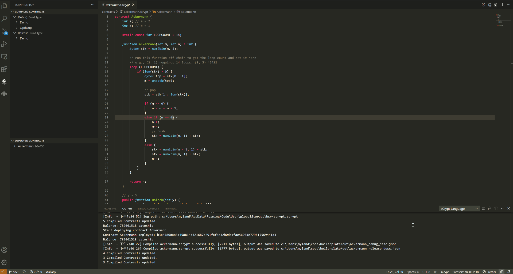
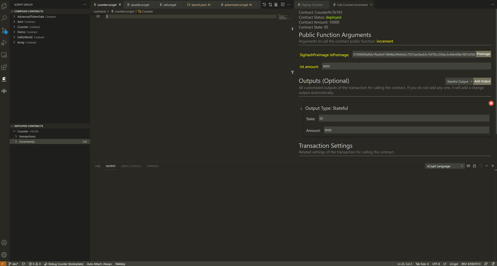

.. _deploy:

===========================================
图形化界面部署调用合约
===========================================

在完成合约的编写与测试之后，通常需要将合约部署到测试网中，以验证合约是否正确，相关交易能否被网络接受。
**IDE** 提供一个通用的 UI 交互界面，只需简单的填写相关参数，就能一键部署合约，点击按钮就能调用合约的 *public* 函数，无须编写一行代码。

.. image:: ./images/deploy.png
    :width: 100%

主要 UI 交换控件包括：

1. 左边的 **sCrypt Deploy** 按钮, 点击可以从其它侧边视图切换到部署视图
2. 本地合约窗口，加载当前工作区 ``out`` 目录下所有已经编译的 :ref:`合约描述文件 <contractdescription>` 
3. 已经部署成功的合约实例窗口
4. 部署合约配置视图。在该视图下填写部署合约的相关参数，包括：构造函数参数，合约锁定的 *satoshis* 余额，以及 `有状态合约`_ 的初始状态。

.. note::

    目前只支持测试网

设置私钥
======================

部署合约到测试网需要先 :ref:`设置私钥 <settings_privatekey>`。如果检测到没有设置私钥，**IDE** 会自打开设置界面，提示设置测试网私钥。

编译合约
===========================================

部署合约到测试网需要先 :ref:`编译合约 <compiling>`。编译完合约后， 本地合约窗口（COMPILED CONTRACTS）会自动刷新出刚刚编译的合约。点击窗口中的合约，打开部署合约配置视图。
也可以通过在代码编辑器上右键单击 **Deploy** 菜单，将会自动以 :ref:`调试编译 <debug_compiling>` 合约，并打开部署合约配置视图。

部署合约
===========================================

打开部署合约配置视图后， 填写合约构造函数的各个参数，以及合约锁定 *satoshis* 余额，如果是状态合约，还需要填写初始的状态，然后点击 **Deploy** 按钮，在 **输出面板** 可以看到部署成功的提示,
在左边的合约实例窗口 (DEPLOYED CONTRACTS) 中会出现对应的实例，点击合约实例上的 View Tx 按钮，则可打开浏览器查看对应的交易。

部署P2PKH合约的时候会有一个Publickey Hash 的输入框，默认值是你设置的私钥的 ``Publickey Hash``，你可以把它修改成别的私钥的 ``Publickey Hash``。
如果你修改了，那么但你解锁它的时候，就需要有对应的私钥的签名。别担心，IDE 允许你输入对应的私钥。
签名输入框中的默认签名是用默认私钥计算的，在输入框的右边，有一个 [Sig] 按钮，点击它输入正确的私钥，就可以计算出正确的签名了。

调用合约
===========================================

普通合约
----------------

点击合约实例上的构造函数，则可查看构造函数调用时的实参。点击 *public* 函数，右边则会出现该函数的调用视图。
和部署合约的过程一样，只需给函数对应的参数赋值，点击 **Call** 按钮，就能调用该函数了。 如果调用成功，可以看到对应的交易， 失败则会打印出对应的错误。

.. image:: ./images/call_demo.gif
    :width: 100%

有状态合约
----------------

在合约调用视图可以看到合约的当前信息，如合约锁定余额、合约当前状态、合约是否已结束等。要调用当前合约的函数，还需要根据情况完成以下几个步骤：

1. 填写调用函数所需的实参。
2. 添加交易输出，对于有状态合约，一般会限制合约的输出脚本，所以需要手动管理所有交易输出。目前支持的输出类型有三种：

===============     ======================================================================================
输出类型             参数
===============     ======================================================================================
状态合约输出          ``State`` : 合约状态的序列化值(hex格式)， ``Amount`` : 合约中锁定的余额(satoshis)
P2PKH输出            ``Address``: 收款人地址， ``Amount`` : 合约中锁定的余额
OpReturn输出         ``OpReturn`` : op_return后数据部分，asm 格式， ``Amount`` : 合约中锁定的余额
===============     ======================================================================================

3. 设置交易相关参数

交易费用 ``Fee``： 根据已经添加的交易输出，以及合约的 *satoshis* 余额自动计算得到。

交易签名类型 ``SighashType``： 默认用于计算交易原象 Preimage 的签名类型是 ALL，可根据合约使用交易签名类型来修改此值。

4. 点击 Call 按钮调用合约

所有设置均完成后点击 Call 按钮，会发送这个合约调用交易到测试网。交易发送成功后，可以看到顶部显示合约余额发生变化。
合约实例的 **transactions** 子项中增加了一个交易，并且可通过右侧的 **View Tx** 按钮在区块链浏览器上进行查看。另外，选中该交易子项时，被调用函数下的参数列表中会显示出此次调用时传递的各个实参。

.. image:: ./images/call_counter.gif
    :width: 100%

5. 重复调用

针对有状态合约，可以重复上面的步骤继续调用其 *public* 函数并观察其状态变更，直到合约中的余额不足。

.. note::

    目前暂不支持合并其它输入来调用合约

调用失败
----------------

通常情况下，调用合约失败，将会在 **输出面板** 输出相应的信息，并生成 ``Launch Debugger`` 链接。 **CRTL + 单击** 链接将根据测试中的参数直接启动调试器会话。

    

参数输入格式
===========================================

部署合约和调用合约都需要在视图中输入正确的参数。参数输入格式参照下表：

===============    ==============================================================================================================
参数类型             输入格式说明
===============    ==============================================================================================================
bool               ``true`` 或者 ``false``
int                十进制数字或十六进制数字，例如: ``123`` 或者 ``0x0123``
bytes              十六进制字符串, 例如: ``036cfa9a0b0abf4fa56e583b99f8d1ba4a2608096283cdea68ecf1d4f5bdefeb1f``
PubKey             十六进制字符串, 同 ``bytes``
PrivKey            同 ``int``
Sig                十六进制字符串, 同 ``bytes``
Ripemd160          十六进制字符串, 同 ``bytes``
Sha1               十六进制字符串, 同 ``bytes``
Sha256             十六进制字符串, 同 ``bytes``
SigHashType        十六进制字符串, 同 ``bytes``
SigHashPreimage    十六进制字符串, 同 ``bytes``
OpCodeType         十六进制字符串, 同 ``bytes``
数组                每个元素分别填写
结构体              每个成员分别填写
===============    ==============================================================================================================

其它功能
===========================================

查看交易
----------------

合约实例窗口下 **transactions** 子项带有 **View Tx** 按钮， 点击可打开区块链浏览器查看该交易详情。

复制值
----------------

在合约实例窗口下选中某个函数，在参数列表上单击右键，会出现 **Copy Value** 菜单， 点击该菜单可以将参数的值复制到剪切板。

清除所有合约实例
----------------

点击该按钮删除所有合约实例。

.. image:: ./images/deploy_clean.png
    :width: 100%

删除单个合约实例
----------------

在合约实例上右键单击会出现 **Delete** 菜单， 点击该菜单可以删除该合约实例。

.. _有状态合约: https://blog.csdn.net/freedomhero/article/details/107307306
.. _stateful contract: https://medium.com/coinmonks/stateful-smart-contracts-on-bitcoin-sv-c24f83a0f783