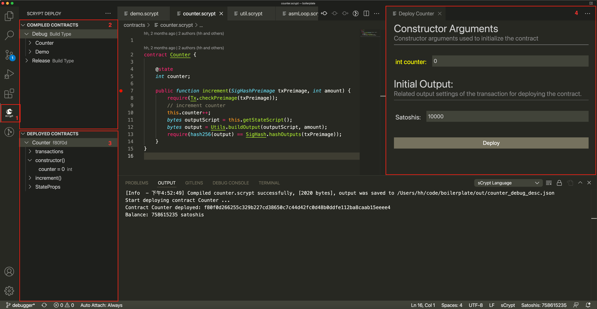

.. _deploy:

===========================================
图形化界面部署调用合约
===========================================

在完成合约的编写与测试之后，通常需要将合约部署到测试网中，以验证合约是否正确，相关交易能否被网络接受。
**IDE** 提供一个通用的 UI 交互界面，只需简单的填写相关参数，就能一键部署合约，点击按钮就能调用合约的 *public* 函数，无须编写一行代码。

主要 UI 交换控件包括：

1. sCrypt按钮 (**sCrypt Deploy**)。点击可以从其它侧边视图切换到部署视图
2. 本地合约窗口 (**COMPILED CONTRACTS**)。加载当前工作区 ``out`` 目录下所有已经编译的 :ref:`合约描述文件 <contractdescription>` 
3. 合约实例窗口 (**DEPLOYED CONTRACTS**)。列出已经部署成功的合约实例
4. 部署合约配置视图。在该视图下填写部署合约的相关参数，包括：构造函数参数，合约锁定的 *satoshis* 余额，以及 `有状态合约`_ 的初始状态。

.. note::

    目前只支持测试网

设置私钥
======================

部署合约到测试网需要先 :ref:`设置私钥 <settings_privatekey>`。如果检测到没有设置私钥，**IDE** 会自打开设置界面，提示设置测试网私钥。

部署合约
===========================================

在代码编辑器上右键单击 **Deploy Contract: Debug** 菜单，将会编译合约，并自动打开部署合约配置视图。在配置视图中需要填写以下信息:

1. 根据合约构造函数的各个 :ref:`参数类型 <inputType>`，填写 **Constructor Arguments** 下的各个参数
2. 填写合约锁定 *satoshis* 余额，默认是 ``10000`` *satoshis*
3. 如果是不带 ``@state`` 修饰器的有状态合约，还需要填写初始的状态
4. 然后点击 **Deploy** 按钮

.. image:: ./images/deploy_demo.gif
    :width: 100%

部署成功后， 可以在 **输出面板** 看到 log 提示， 并在左边的合约实例窗口中会出现对应的实例，点击合约实例上的 **View Tx** 按钮，则可打开浏览器查看对应的交易。

调用合约
===========================================

普通合约
----------------

点击合约实例上的构造函数，则可查看构造函数调用时的实参。点击 ``public`` 函数，右边则会出现该函数的调用视图。
对于调用普通合约，一般只需在 **Public Function Arguments** 下填写正确的解锁参数，点击 **Call** 按钮，就能调用该函数了。 如果调用成功，可以看到对应的交易， 失败则会打印出对应的错误。

合约调用成功后，我们可以看到如下信息:

1. 调用合约时所填写的解锁参数的值
2. 合约是否结束
3. 合约剩余的 *satoshis*
4. 调用合约产生的交易，点击 **View Tx** 按钮可查看交易。

有状态合约
----------------

调用有状态合约需要更多设置:

1. 填写正确的解锁参数（同普通合约)。需要注意有 :ref:`两种特殊类型 <specialInputType>` 的解锁参数

2. 添加交易输出，对于有状态合约，需要根据合约的限制添加相应的交易输出。目前支持的输出类型有四种：

===============     ======================================================================================
输出类型             参数
===============     ======================================================================================
有状态合约输出         :ref:`见下文 <statefulOutput>`
P2PKH输出            ``Address``: 收款人地址， ``Amount`` : 合约中锁定的余额
OpReturn输出         ``OpReturn`` : op_return后数据部分，asm 格式， ``Amount`` : 合约中锁定的余额
Hex输出              ``hex`` : 任意输出的 ``hex`` 字符串
===============     ======================================================================================

3. 设置交易相关参数

    1. 交易费用 ``Fee``： 根据已经添加的交易输出，以及合约的 *satoshis* 余额自动计算得到。

    2. 交易签名类型 ``SighashType``： 默认用于计算交易原象 Preimage 的签名类型是 ALL，可根据合约使用交易签名类型来修改此值。

    3. ``nLockTime``： nLockTime 是应用于在 unix 时间或块高度中指定的每个事务的参数，在此之前，该事务不能被接受到一个块中。

4. 点击 Call 按钮调用合约

所有设置均完成后点击 **Call** 按钮，会发送这个合约调用交易到测试网。交易发送成功后，可以看到顶部显示合约余额及状态发生变化。
合约实例的 **transactions** 子项中增加了一个交易，并且可通过右侧的 **View Tx** 按钮在区块链浏览器上进行查看。另外，选中该交易子项时，被调用函数下的参数列表中会显示出此次调用时传递的各个实参。

5. 重复调用

针对有状态合约，可以重复上面的步骤继续调用其 ``public`` 函数并观察其状态变更。可以在合约实例窗口中的 **StateProp** 条目上查看合约的最新状态。

如果调用合约失败， 在 **输出面板** 会打印出 :ref:`启动调试器 <Launch_Debugger_Link>` 的连接。CTRL + 单击链接启动调试器

.. image:: ./images/launch_debugger_from_deploy.gif
    :width: 100%

.. note::

    目前暂不支持合并其它输入来调用合约

调用失败
----------------

通常情况下，调用合约失败，将会在 **输出面板** 输出相应的信息，并生成 ``Launch Debugger`` 链接。 **CRTL + 单击** 链接将根据测试中的参数直接启动调试器会话。

.. image:: ./images/call_fail.gif
    :width: 100%

.. _statefulOutput:

有状态合约输出
===========================================

有状态合约的输出包含两种格式的输出：

    1. 有状态合约不包含带有 ``@state`` 装饰器的属性。
        需要填写 ``State`` （合约状态的序列化值，hex格式) 和 ``Amount`` (合约中锁定的余额satoshis) 两个参数。

    .. image:: ./images/stateful_output1.png
        :width: 100%

    2. 有状态合约包含带有 ``@state`` 装饰器的属性。
        需要填写 ``Amount`` 参数，以及所有被 ``@state`` 装饰器修饰的属性。

    .. image:: ./images/stateful_output2.png
        :width: 100%

.. _inputType:

参数输入格式
===========================================

所有参数类型
-------------

部署合约和调用合约都需要在视图中输入正确的参数。参数输入格式参照下表：

===============    ==============================================================================================================
参数类型             输入格式说明
===============    ==============================================================================================================
bool               ``true`` 或者 ``false``
int                十进制数字或十六进制数字，例如: ``123`` 或者 ``0x0123``
bytes              十六进制字符串, 例如: ``036cfa9a0b0abf4fa56e583b99f8d1ba4a2608096283cdea68ecf1d4f5bdefeb1f``
PubKey             十六进制字符串, 同 ``bytes``
PrivKey            同 ``int``
Sig                十六进制字符串, 同 ``bytes``
Ripemd160          十六进制字符串, 同 ``bytes``
Sha1               十六进制字符串, 同 ``bytes``
Sha256             十六进制字符串, 同 ``bytes``
SigHashType        十六进制字符串, 同 ``bytes``
SigHashPreimage    十六进制字符串, 同 ``bytes``
OpCodeType         十六进制字符串, 同 ``bytes``
数组                每个元素分别填写
结构体              每个成员分别填写
===============    ==============================================================================================================

.. _specialInputType:

特殊参数类型
-------------

1. ``Sig`` 类型
   
    不需要手动填写。 **IDE** 默认使用设置中的私钥自动生成一个签名，作为该参数的默认值。如果你需要使用其它私钥进行签名，点击输入框右边的 **Sig** 按钮，
    在弹出的输入框上输入正确的私钥。**IDE** 会根据输入的私钥生成新的参数值并自动更新该参数。

2. ``SigHashPreimage`` 类型
   
    不需要手动填写。**IDE**  会根据你添加的输出，设置的交易相关参数，比如 ``SigHashType``, ``nLockTime``， 计算出交易第一个输入的 preimage 原象，并自动更新该参数。

其它功能
===========================================

查看交易
----------------

合约实例窗口下 **transactions** 子项带有 **View Tx** 按钮， 点击可打开区块链浏览器查看该交易详情。

.. image:: ./images/deploy_viewtx.png
    :width: 100%

复制值
----------------

在合约实例窗口下选中某个函数，在参数列表上单击右键，会出现 **Copy Value** 菜单， 点击该菜单可以将参数的值复制到剪切板。

.. image:: ./images/deploy_copyvalue.png
    :width: 100%

清除所有合约实例
----------------

点击该按钮删除所有合约实例。

删除单个合约实例
----------------

在合约实例上右键单击会出现 **Delete** 菜单， 点击该菜单可以删除该合约实例。

.. image:: ./images/deploy_delete_instance.png
    :width: 100%

.. _有状态合约: https://blog.csdn.net/freedomhero/article/details/107307306
.. _stateful contract: https://medium.com/coinmonks/stateful-smart-contracts-on-bitcoin-sv-c24f83a0f783