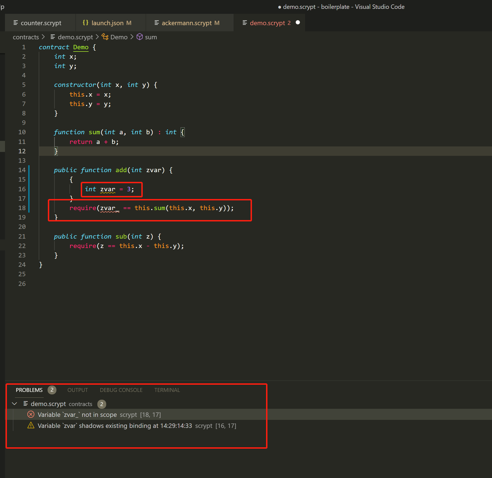
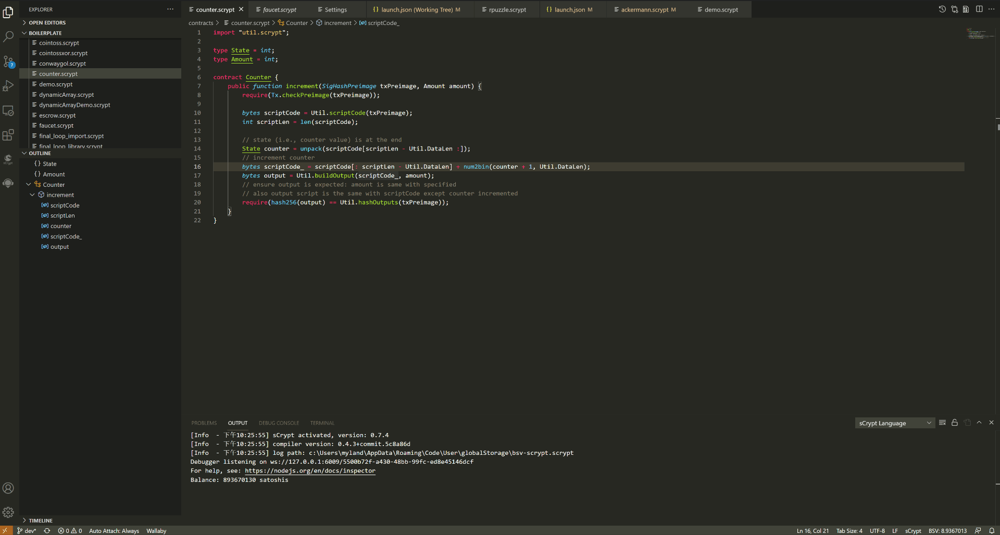

===============
代码编辑器
===============

语法高亮
===============

**IDE** 内置了一个 **sCrypt** 语言的代码着色器，打开 `*.scrypt` 文件的时候可以看到某些语法元素显示高亮的效果，例如，关键字（如 `loop` `require`)
用一种颜色，类型（如 `int` 和 `bytes`) 用另一种颜色。

悬浮提示
===============

当移动鼠标悬停在一个符号上时，会自动显示符号相关的信息

自动补全
===============

当在编辑器上输入代码时， **IDE** 会根据你的输入，自动补全相关输入。

函数签名帮助
===============
  
在代码编辑过程中，**IDE** 会根据你的输入，自动给出函数签名的相关提示。

.. image:: ./images/signature_help.gif
  :width: 100%

错误和警告标记
===============

修改代码时，可能会看到不同颜色的波浪下划线， 红色波浪线表示语法错误，黄色表示警告。 可以根据错误提示信息来快速修复问题。所有文件的错误信息都汇聚在 **问题** 面板中，如果修改了代码消除了错误，
**问题** 面板中的错误提示就会自动消失。

  

代码导航
===============

.. toctree::
    :maxdepth: 2
 
    moveincode

重命名符号
===============

重命名代码符号的标识符，例如合约名称，合约属性、本地变量、函数、类型。

将文本光标置于要重命名的代码符号：

键盘：按 ``F2``

鼠标：右键单击代码并选择“重命名”。

格式化代码
===============

打开要格式化的代码

键盘：按 ``Shift + Alt + F``

鼠标：右键单击代码并选择“格式化文档”。

格式后如果发现某行代码太长，可以尝试手动将其断行在格式化，“格式化文档”会保留您的断行信息

.. note::

   格式化之前，需要先确保代码没有语法错误，可以正常编译

  