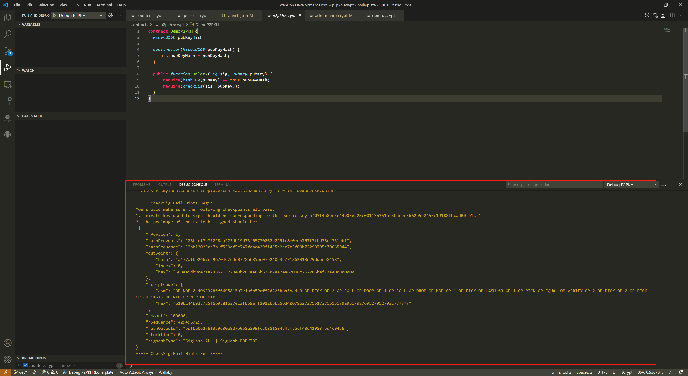
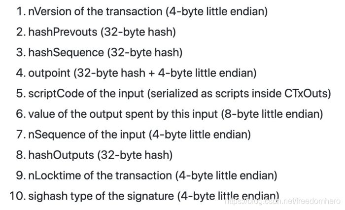
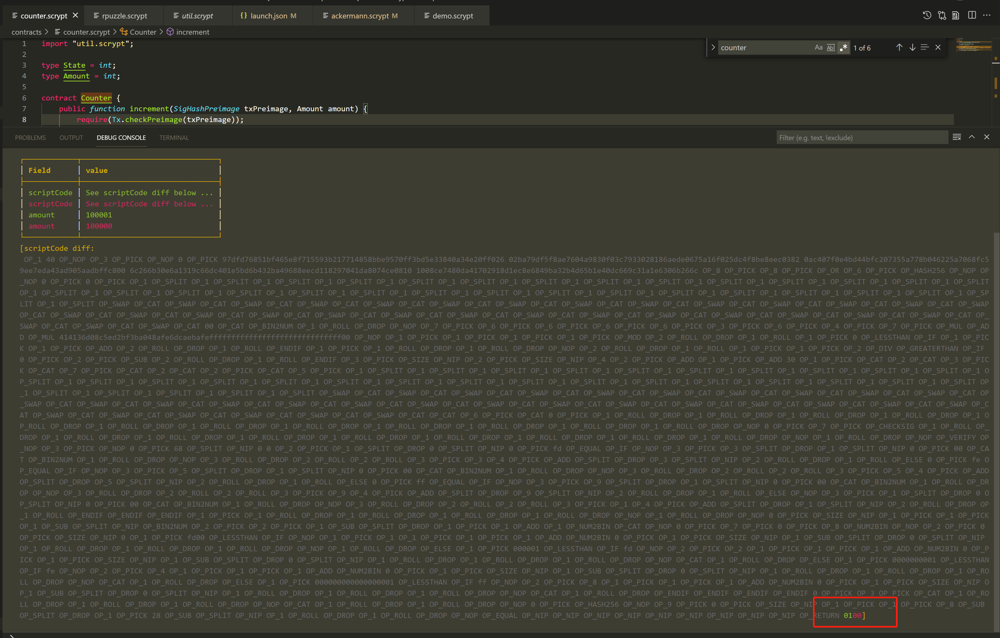
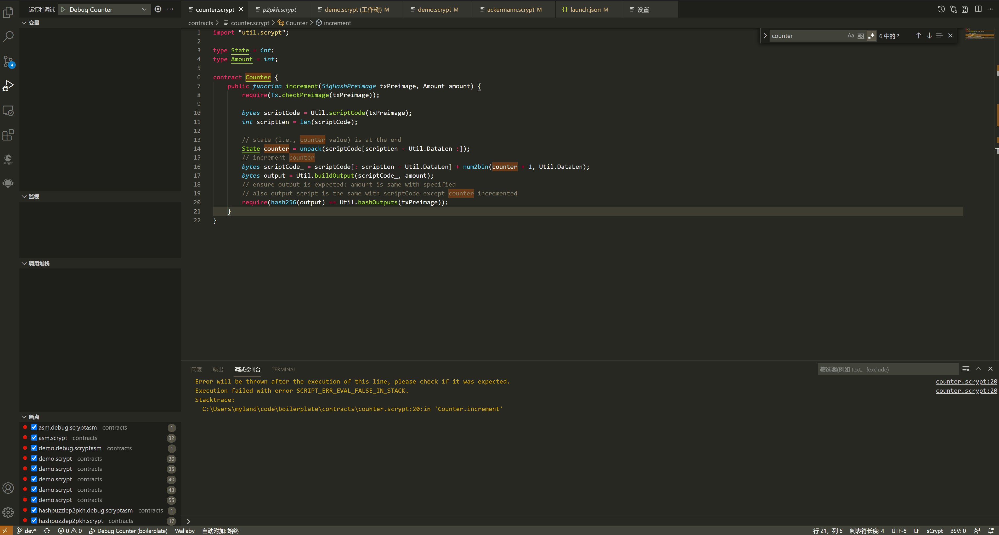

异常自动中断
-----------------------------------

调试器在执行过程中遇到代码中的异常会自动中断执行，并保留现场，这让你有机会在调用调试器之前对异常进行诊断。您可以通过查看中断现场变量的值，调用堆栈，监视的表达式来
诊断异常，也可在调试控制器中执行代码来分析异常。

.. image:: ./images/stoponexception.png
  :width: 100%

对于一些典型的异常，我们提供了更多的信息和方法，以供您分析、诊断异常。

签名检查失败
-----------------------------------

一类常见的错误是 ``CheckSig`` 异常,通常是由于签名问题导致的。具体原因通常是：

1. 您使用了与公钥不匹配的 **错误私钥**  对交易进行了签名
2. 您对错误的 **交易原象** (Preimage) 进行了签名。

调试控制台会提示您正确的，应该被用于签名的信息。

上述提示信息涵盖了解决签名错误时的主要检查点，即:

1. 确定生成签名所使用私钥是否正确。
2. 确认待签名 **tx** 的 **preimage** (根据 **交易上下文** 自动计算得到)与传入参数是否一致。这里的小技巧是：在生成输入参数 **preimage** 的地方插入一段代码，与上述异常提示中输出的 **preimage** 进行对比，进而找出二者可能存在的差异。如以下代码所示：

.. code-block:: javascript
    :linenos:

    const { getPreimage, SigHashPreimage, signTx } = require('scryptlib');

    ...

    const preimage = getPreimage(tx_, token.lockingScript.toASM(), inputSatoshis, inputIndex)
    const sig = signTx(tx_, privKey, token.lockingScript.toASM(), inputSatoshis)
    console.log(preimage.toJSON())

这里需要再次提醒大家的是，调试器启动配置 ``txContext`` （交易上下文） 属性下的字段都会影响 **preimage** 的计算，所以在排查问题时需要逐一对比确认是否一致。

交易原象检查失败
-----------------------------------

另一类常见的错误是 ``checkPreimage`` 异常,通常是由于签名问题导致的。具体原因通常是在启动配置参数 ``pubFuncArgs`` 中传入的数值与使用 ``txContext`` 中各项参数所计算出的结果不一致。

如上图所示，Sighash Preimage 由多个部分组合而成，如果两个原像不一致，一定是其中某些字段不相同。发生这类异常时，**调试控制台** 会自动打印错误提示信息，其中会有一个包含两个原像所有不同
字段的表格，如果是 ``scriptCode`` 字段不同，还会打印出两个 ``scriptCode`` 字段的对比结果，有了这些错误信息，您可以快速分析出来异常的原因了。

交易输出哈希不一致
-----------------------------------

这通常是由于当前交易的一个或者多个 **输出** 不符号合约本身逻辑对当前 **交易输出** 的约束。例如下面的例子：

``Counter`` 合约约束 **交易输出** 中的 ``satoshis`` 必须等于解锁参数 ``amount``， 但是实际 **交易输出** 中的 ``satoshis`` 为 ``222222``, 而解锁参数 ``amount`` 的值为 ``2222222``。
由于合约中检查的是哈希是否一致，所以出现这类错误的时候，您只知道是 **交易输出** 哈希不一致，却不知道是哪个 **交易输出** 不一致，也不知道 **交易输出** 具体哪里不一致。这个时候您可以通过
调试控制台的 ``:diffoutputs`` 内置命令， 将合约产生的 **交易输出** 和来自 当前交易的 **交易输出** 进行对比。

