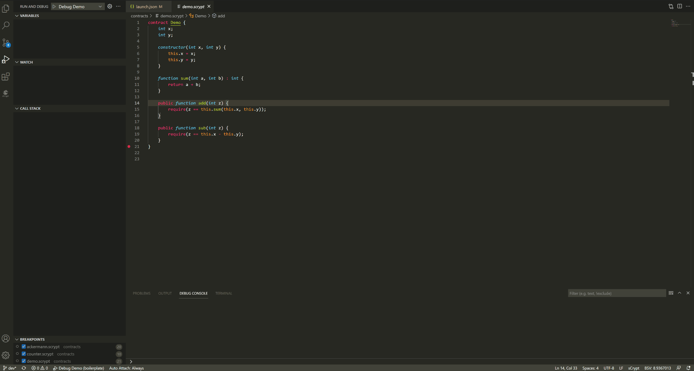
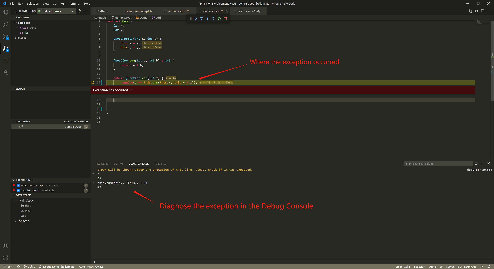

调试器启动失败
-----------------------------------

通常是 *launch.json* 的输入参数填写有问题，比如：

1. 参数个数不匹配

2. 参数类型不匹配
   
3. :ref:`参数输入格式 <scryptTypes>` 不正确
   
4. 忘记提供 :ref:`交易上下文 <txContext>`

出现该错误时，打开 *launch.json* 文件，检查参数是否正确填写。

异常自动中断
-----------------------------------

调试器在执行过程中遇到代码中的异常会自动中断执行，并保留现场，便于异常进行诊断。可以通过查看中断现场的变量值，调用堆栈，监视的表达式来
诊断异常，也可在调试控制台执行代码来分析异常。

对于一些典型的异常，调试器提供了更多的信息和方法，以供分析和诊断异常。

签名检查失败
-----------------------------------

一类常见的错误是 ``checkSig`` 失败。原因可能是：

1. 使用了与公钥不匹配的 **错误私钥**  对交易进行了签名
2. 对错误的 **交易原象** (Preimage) 进行了签名。

调试控制台会提示辅助信息。

上述提示信息涵盖了解决签名错误时的主要检查点，即:

1. 确定生成签名所使用私钥是否正确。
2. 确认待签名 **tx** 的 **preimage** (根据 **交易上下文** 自动计算得到)与传入参数是否一致。这里的小技巧是：在生成输入参数 **preimage** 的地方插入一段代码，与上述异常提示中输出的 **preimage** 进行对比，进而找出二者可能存在的差异。如以下代码所示：

.. code-block:: javascript
    :linenos:

    const { getPreimage, SigHashPreimage, signTx } = require('scryptlib');

    ...

    const preimage = getPreimage(tx_, token.lockingScript.toASM(), inputSatoshis, inputIndex)
    const sig = signTx(tx_, privKey, token.lockingScript.toASM(), inputSatoshis)
    console.log(preimage.toJSON())

这里需要再次提醒大家的是，调试器启动配置 ``txContext`` （交易上下文） 属性下的字段都会影响 **preimage** 的计算，所以在排查问题时需要逐一对比确认是否一致。

交易原象检查失败
-----------------------------------

另一类常见的错误是 ``checkPreimage`` 异常。通常原因是在启动配置参数 ``pubFuncArgs`` 中传入的数值与使用的 ``txContext`` 中各项参数所计算出的结果不一致。

如上图所示，Sighash Preimage 由多个部分组合而成。如果两个原像不一致，一定是其中某些字段不相同。发生这类异常时，**调试控制台** 会自动打印错误提示信息，其中会有一个包含两个原像所有不同
字段的表格。如果是 ``scriptCode`` 字段不同，还会打印出两个 ``scriptCode`` 字段的对比结果。有了这些错误信息，就可以快速分析出异常的原因了。

.. _diffoutputs:

交易输出哈希不一致
-----------------------------------

这通常是由于当前交易的一个或者多个 **交易输出** 不符号合约本身逻辑对 **输出** 的约束。例如下面的例子：

`Counter`_ 合约约束 **输出** 中的 *satoshis* 必须等于解锁参数 ``amount``， 实际 **输出** 中的 *satoshis* 为 ``222222``, 而解锁参数 ``amount`` 的值为 ``2222222``。

由于合约中检查的是哈希是否一致，所以出现这类错误的时候，只能知道是 **输出** 哈希不一致，无法直接定位出二者之间的差异。

调试控制台提供 ``:diffoutputs`` 内置命令， 可以将合约产生的 **输出** 和来自 当前交易的 **输出** 进行对比，进而快速找出二者可能存在的差异。

.. image:: ./images/diffoutputs.gif
  :width: 100%

.. _Counter: https://github.com/sCrypt-Inc/boilerplate/blob/master/contracts/counter.scrypt