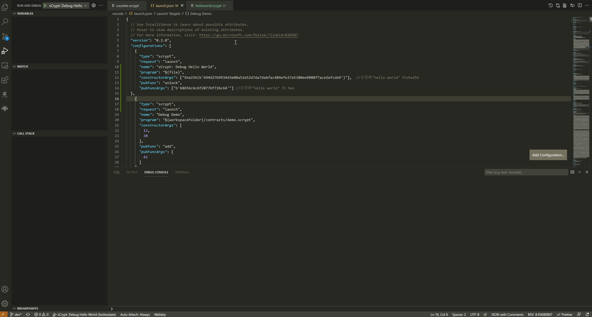

Hello World
===========================================

初始化项目
----------

开始编写合约之前，先创建一个helloworld目录，并进入到目录，然后创建 ``helloworld.scrypt`` 文件。

编写合约
--------------------

.. code-block:: solidity

    /**
    * contract HelloWorld
    */
    contract HelloWorld {
        Sha256 hash;

        public function unlock(bytes message) {
            require(sha256(message) == this.hash);
        }
    }

运行合约
--------------------

打开 VS Code 的 **运行和调试** 视图，点击 **创建 launch.json 文件** 按钮，创建如下配置：

.. code-block:: console

    {
        "version": "0.2.0",
        "configurations": [
            {
                "type": "scrypt",
                "request": "launch",
                "name": "sCrypt: Debug Hello World",
                "program": "${file}",
                "constructorArgs": ["Sha256(b'b94d27b9934d3e08a52e52d7da7dabfac484efe37a5380ee9088f7ace2efcde9')"],  //字符串"hello world" 的sha256
                "pubFunc": "unlock",
                "pubFuncArgs": ["b'68656c6c6f20776f726c64'"] //字符串"hello world" 的 hex 
            }
        ]
    }

.. image:: ./images/createlaunch.gif
    :width: 100%

打开 ``helloworld.scrypt`` 文件, 按 **F5** 启动调试器，**调试控制台** 会输出 ``Execution successful.``

恭喜你，完成了一个 ``HelloWorld`` 合约的开发和运行