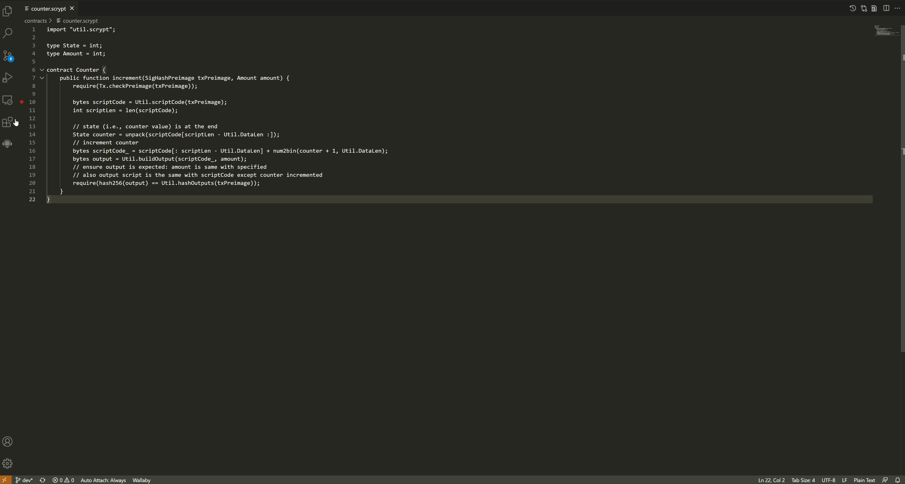
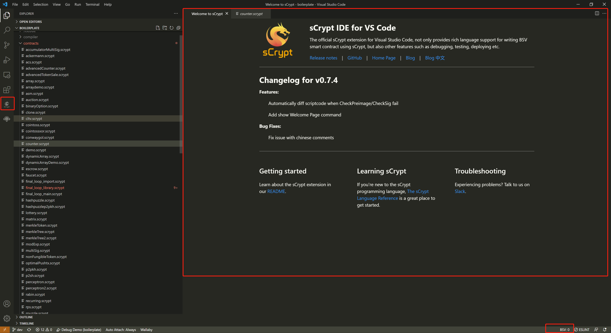

安装
===========================================

- 安装 `Nodejs <https://nodejs.org>`_, require `version >= 12`

- 安装 `Visual Studio Code <https://code.visualstudio.com>`_

- 安装 `sCrypt IDE <https://marketplace.visualstudio.com/items?itemName=bsv-scrypt.sCrypt>`_，在 VS Code 插件市场搜索 **sCrypt**， 并点击安装，安装成功后，
  窗口左边的会出现一个侧边视图切换按钮 **sCrypt Deploy**， 如下图：

欢迎界面
===========================================

安装完成后，尝试打开样本项目，会看到如下欢迎界面。

欢迎界面上有官网地址，博客地址，联系方式和历史版本记录。通常也会显示当前版本的新功能，以及修复的问题。

