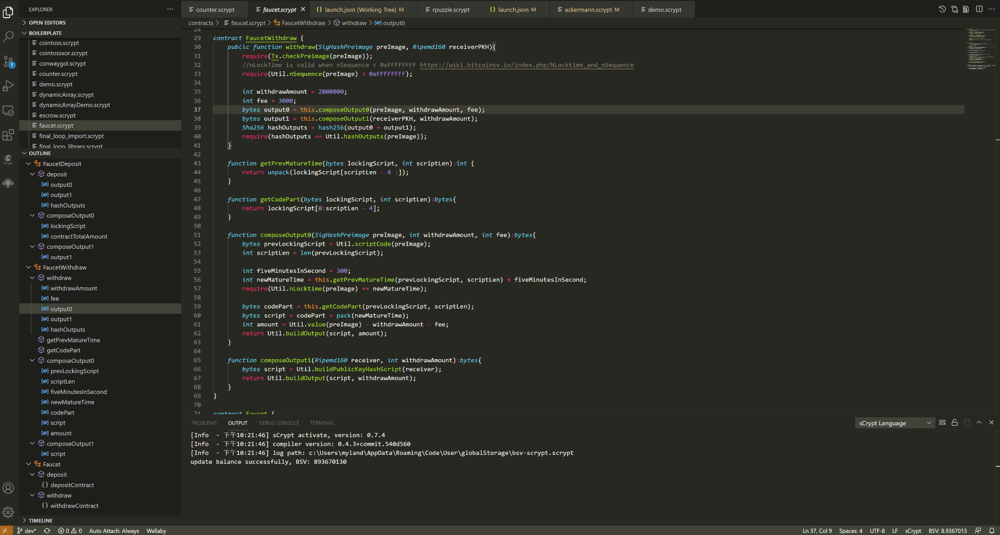

大纲
-----------------------------------

可使用“大纲”（在资源管理器中），在基本代码中导航代码。 点击对于的项目，代码编辑器就会跳转到对应的代码

转到符号
-----------------------------------

如果您想跳转到当前文件中的某个符号， 可以按以下快捷键:

Windows: ``Ctrl + Shift + o``

Mac: ``Command + Shift+ o``

Ubuntu: ``Ctrl + Shift + o``

如果当前文件代码比较多，跳转到符号能够大大提升您查找代码的效率

.. image:: ./images/gotosymbol.gif
  :width: 100%

查找所有引用
-----------------------------------

在你想要查找其引用的元素的上下文（右键单击）菜单中可以使用“查找所有引用”命令, 可以在整个代码库中查找引用该代码元素的位置。如果使用键盘，请按 ``Shift + Alt + F12`` 。

.. image:: ./images/findallref.gif
  :width: 100%

转到定义
-----------------------------------

当您需要查看符号在代码中的定义，“转到定义”功能可导航到符号定义的位置，如果符号不是在当前文件定义的，会在新选项卡中打开结果。

.. image:: ./images/gotodefinition.gif
  :width: 100%

