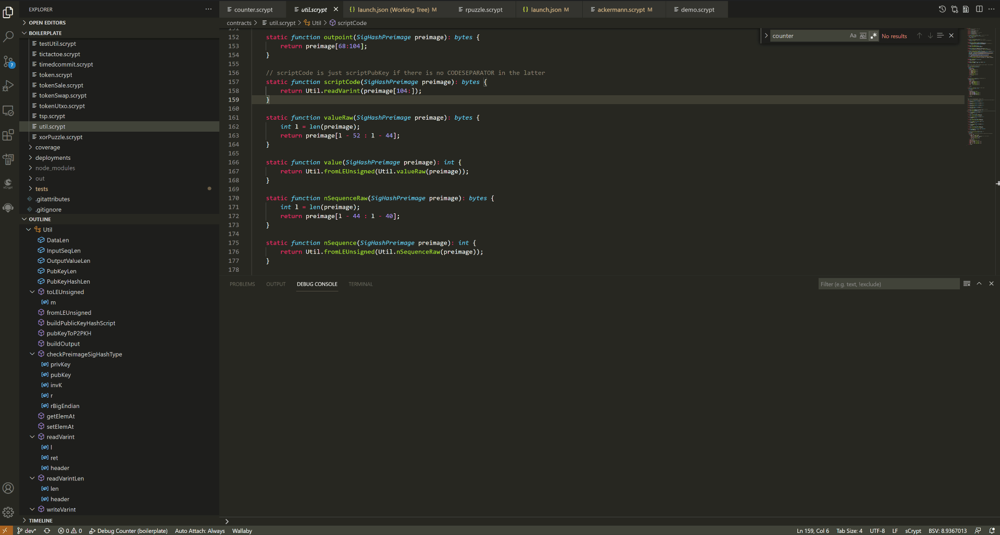
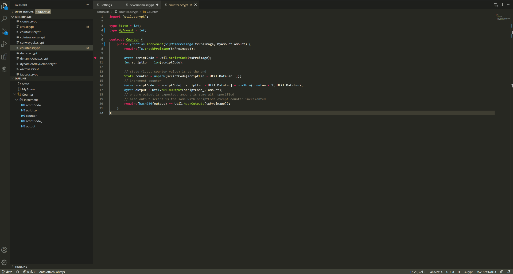

大纲
-----------------------------------

可使用“大纲”（在资源管理器中）在代码中导航。 点击对于的项目，代码编辑器就会跳转到对应的代码。

.. image:: ./images/outline.gif
  :width: 100%

转到符号
-----------------------------------

如果想跳转到当前文件中的某个符号，可以按以下快捷键:

Windows: ``Ctrl + Shift + o``

Mac: ``Command + Shift+ o``

Ubuntu: ``Ctrl + Shift + o``

如果当前文件代码比较多，跳转到符号能够大大提升查找代码的效率

查找所有引用
-----------------------------------

在代码元素上右键单击，使用“查找所有引用”命令，可以在整个代码库中查找引用该代码元素的上下文。如果使用键盘，请按 ``Shift + Alt + F12`` 。

转到定义
-----------------------------------

**Ctrl + 单击** 是鼠标用户快速访问 **转到定义** 的快捷方式。当需要查看符号在代码中的定义，按 Ctrl 并将鼠标悬停在类型或变量上，符号变为可单击。
要快速导航到某个符号的定义，按 Ctrl 键然后单击该符号。如果符号不是在当前文件定义的，会在新选项卡中打开结果。

查看定义
-----------------------------------

“查看定义” 功能有助于预览类型的定义，无需离开编辑器中的当前位置。 如果使用键盘，请将文本游标放置在类型或成员名称内的某个地方，然后按 **Alt + F12** 。
如果使用鼠标，可以选择右键单击菜单中的“速览定义”。

