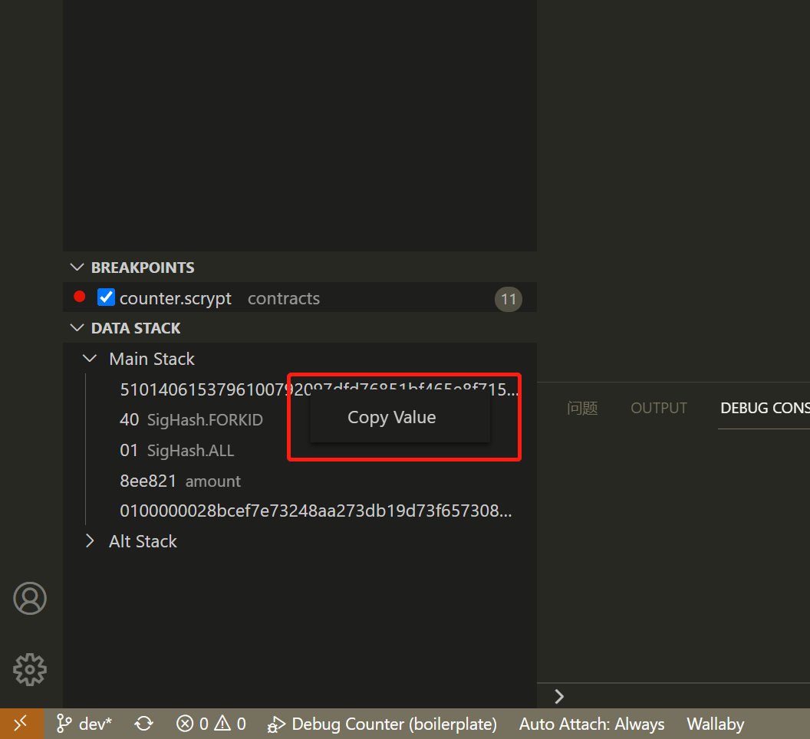

.. _premium:

===========================================
高级付费功能
===========================================

.. _buy_license:

购买许可证
==========================================

使用我们的高级付费功能需要先购买高级许可证

高级许可证收费
------------------

``10`` 美元 每个许可证

高级许可证的有效期
----------------------

当前阶段颁发的所有许可证对于我们的早期采用者都将终身有效。

如何获得高级许可证
--------------------

通过使用 `Baemail <https://baemail.me/>`_ 服务向我们的官方邮件地址 scrypt@moneybutton.com 发送标题为 ‘Purchase An sCrypt Premium License’ 的邮件，
同时在其中支付单个用户高级许可证的费用。待我们收到并确认后，会回复相应的高级许可证给发件人。

如何使用高级许可证
-------------------

收到许可证后，在设置中 :ref:`设置激活 <settings_license>`

.. _script_level_debugging:

比特币脚本调试
==========================================

**sCrypt IDE** 提供的调试器，不仅支持进行sCrypt 源码级的调试，也支持比特币脚本级的调试。
当调试器进入中断模式后，点击代码编辑器右上角的 **View Script in debugging** 按钮，即可打开脚本视图，主要包括这几个功能点：

1. sCrypt 源码与其编译出的 Script 脚本之间关联的实时展示；
2. 通过单击代码行左侧的边缘来设置断点，通过按 **F10** 或 **F11** 开始单步执行比特脚本。更多调试技巧参阅 :ref:`调试器 <debugger>` 
3. 在左下脚的 **Data Stack** 窗口查看比特堆栈的实时状态；

.. image:: ./images/asm_debugging.gif
  :width: 100%

复制值
-------------------

在 **Data Stack** 窗口中数据项上单击右键，会出现 **Copy Value** 菜单，点击改菜单可以将栈上的数据复制到剪切板。

利用这个功能可以方便高级用户进一步提高 sCrypt 的开发调试效率，并且方便地进行一些优化。

.. _optimize:

优化生成
==========================================

