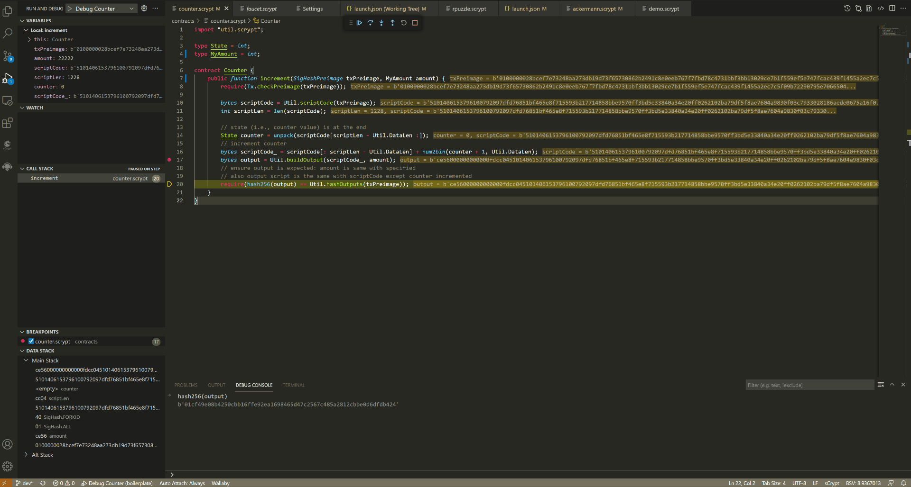
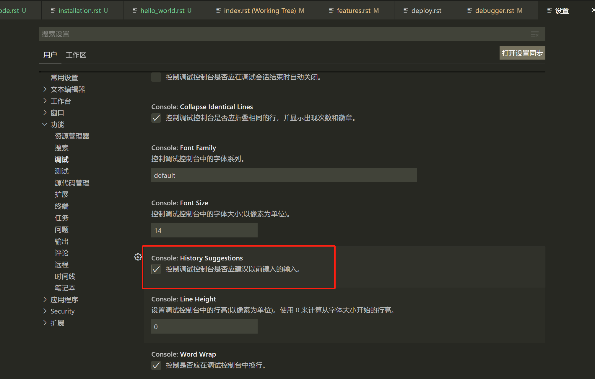

调试控制台, 又称为交互式窗口 **REPL** (**R** ead/**E** valuate/**P** rint/**L** oop)，可以极大地缩短了常用的“编译-生成-调试”周期，提高开发效率。
REPL中可以输入变量，表达式，同时还有一些方便调试异常的内置命令。

要打开调试控制台，请使用调试视图顶部的调试控制台操作或使用 **查看：调试控制台** 命令, 键盘快捷键是 **Ctrl+Shift+Y**。

.. note::

  必须处于正在运行的调试会话中才能使用调试控制台

执行表达式
================
当调试器停在任意断点上，你可以在调试控制台中查看变量，执行表达式

.. image:: ./images/repl.gif
  :width: 100%

自动提示
================

当在调试控制台输入代码时， **IDE** 会根据你的输入，自动提示补全。

历史记录
================

**历史记录** 功能需要开启相应设置。如果没有开启，找到 设置->功能->调试->Console->History Suggestions，并开启。

内置命令
================

所有内置命令均以 ``:`` 开头

===============     ======================================================================================
命令                功能
===============     ======================================================================================
:hex2Asm            将 ``bytes`` 类型的脚本转换成 **asm** 并打印
:parsePreimage      将 ``bytes`` 类型的原象转换成 **json** 并打印
:diffoutputs        将指定 ``output`` 与当前交易的 **output** 进行对比，打印出他们的不同之处。具体用法见：
                    :ref:`交易输出哈希不一致 <diffoutputs>`
===============     ======================================================================================

