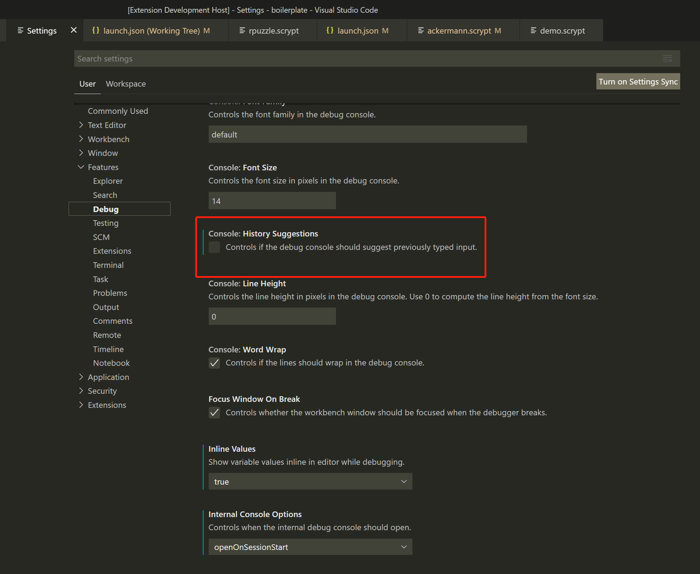

调试控制台, 又称为交互式窗口 **REPL** (**R** ead/**E** valuate/**P** rint **L** oop)，可以极大地缩短了常用的“编译-生成-调试”周期，提高您的开发效率。
**sCrypt IDE** 支持您在调试控制台中输入变量，表达式，同时还有一些内置命令，方便您调试异常。

要打开调试控制台，请使用调试视图顶部的调试控制台操作或使用 **查看：调试控制台** 命令, 键盘快捷键是 **Ctrl+Shift+Y**。

.. note::

  您必须处于正在运行的调试会话中才能使用调试控制台

自动提示
================

调试过程中，当您在调试控制台输入代码时， **sCrypt IDE** 会根据您的输入，自动提示，您可以选择想要的提示项进行补全。

.. image:: ./images/repl-completion.gif
  :width: 100%

历史记录
================

**历史记录** 功能需要开启相应设置，如果您没有开启，可以找到 设置->功能->调试->Console->History Suggestions，并开启。

内置命令
================

所有内置命令均以 ``:`` 开头

===============     ======================================================================================
命令                功能
===============     ======================================================================================
:hex2Asm            将 ``bytes`` 类型的脚本转换成 **asm** 并打印
:parsePreimage      将 ``bytes`` 类型的原象转换成 **json** 并打印
:diffoutputs        将指定 ``output`` 与当前交易的 **output** 进行对比，打印出他们的不同之处，具体用法见：
                    :ref:`交易输出哈希不一致 <diffoutputs>`
===============     ======================================================================================

