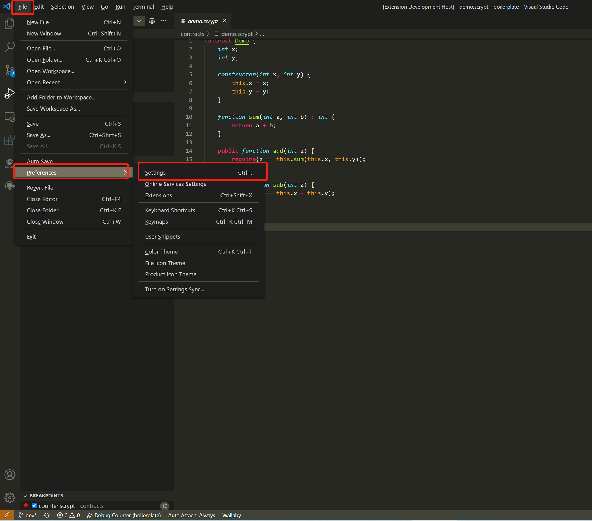
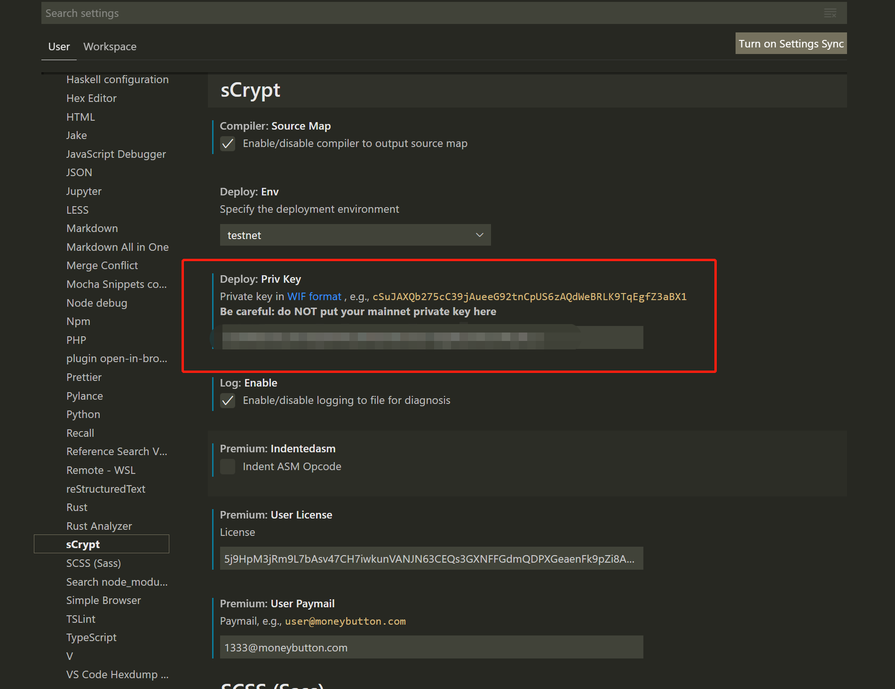
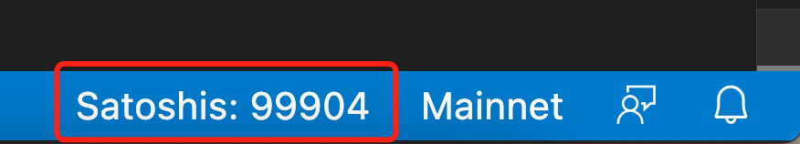
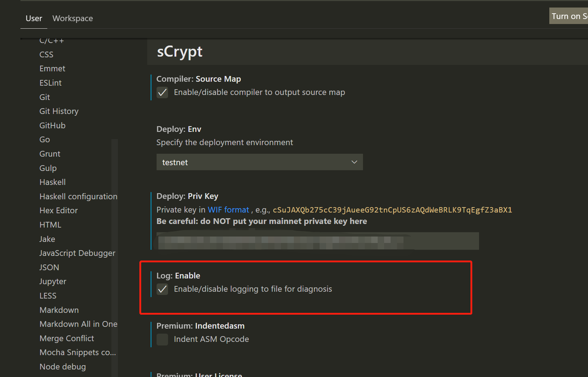
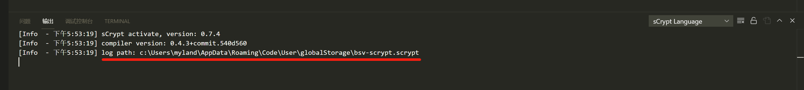
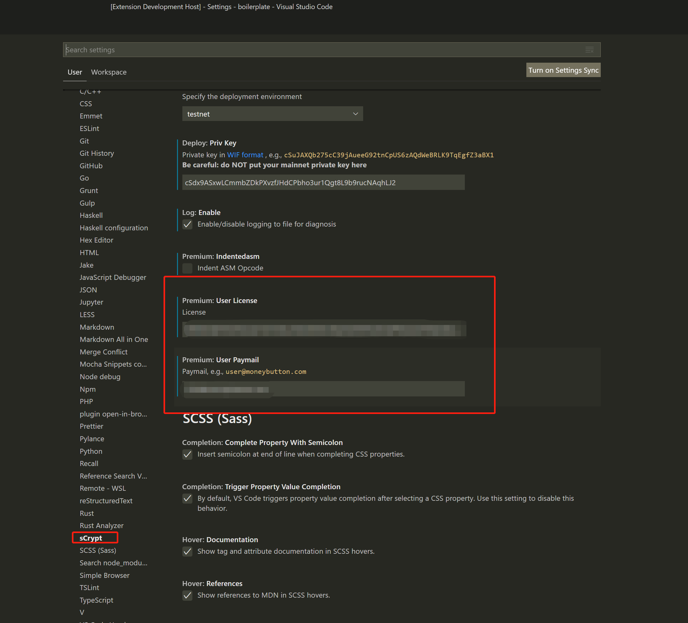
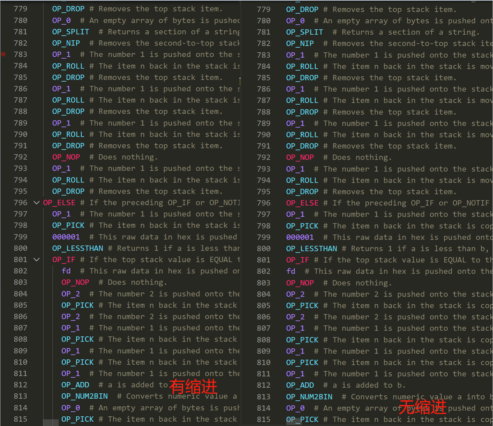

===========================================
设置
===========================================

在 VS Code 中打开 “文件” -> “首选项” -> “设置” -> “扩展” -> **sCrypt**

.. _settings_privatekey:

私钥
===========================================

在设置项中找到 **Priv Key**，输入您的测试网私钥，有了测试网私钥后，您才能使用部署合约的相关功能。

.. warning::

  请勿在此处输入您主网上的私钥

状态栏私钥余额
===========================================

设置好私钥后，状态栏右下角的 **BSV** 按钮会自动更新，显示出该私钥对应地址的比特币余额。

Log 开关
===========================================

在设置项中找到 **Log** > **Enable**，开启 log开关 后，您将在 **输出面板** 中看到更多的信息。

同时，**sCrypt IDE** 会将所有的 log 输出一个到文件中并保存在磁盘上。在 **sCrypt IDE** 激活时，您可以在 **输出面板** 中看到 log 保存的目录：

.. note::

    默认情况下log是关闭，在遇到问题时，我们的开发人员可能会请你开启Log以协助分析问题。

高级付费功能设置
===========================================

.. _settings_license:

高级许可证设置 
-----------------------------------------

首先您需要购买我们的 :ref:`高级许可证 <buy_license>` ，在设置项中找到 **Premium: User License** 和 **Premium: User Paymail**,  配置好相应的 Paymail 及 License 信息，就可以顺利使用所有的高级功能了。

.. note::

  高级许可证验证成后窗口右下角会有通知提示

ASM操作码缩进设置
-----------------------------------------

在设置项中找到 **Premium: Indentedasm**，开启后，在使用 :ref:`比特币脚本调 <script_level_debugging>` 功能时，ASM操作码会缩进显示。

