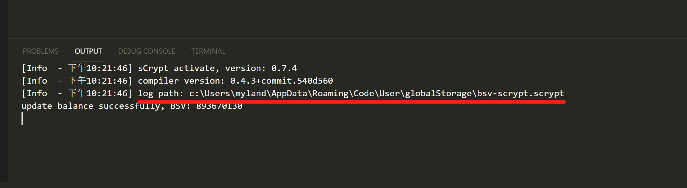
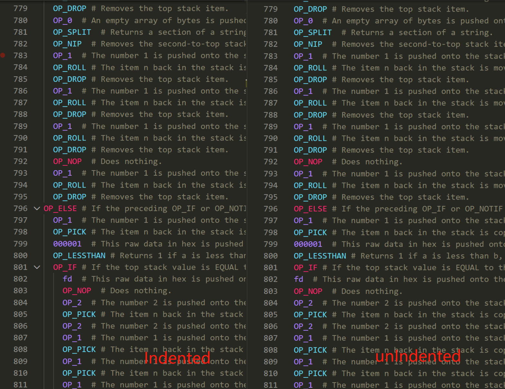

===========================================
设置
===========================================

**window** 系统和 **Linux** 系统:

在 VS Code 中打开 “文件” -> “首选项” -> “设置” -> “扩展” -> **sCrypt**，可观看所有设置选项。

.. image:: ./images/settings.png
  :width: 100%

**MacOS** 系统: 

在 VS Code 中打开 “代码” -> “首选项” -> “设置” -> “扩展” -> **sCrypt**，

.. _settings_env:

部署环境
===========================================

用于指定合约的部署网络，包括测试网和主网。

.. _settings_privatekey:

私钥
===========================================

测试网私钥
----------

在设置项中找到 **Priv Key**，输入你的测试网私钥。有了私钥后，才能使用部署合约的相关功能。

如果你没有设置私钥，**IDE** 将自动设置一个随机生成的私钥，并从 `水龙头`_ 获取测试网小额比特币。你可以通过执行 ``sCrypt: Get BSV From Faucet`` 命令来从获取。

主网私钥
----------

在设置项中找到 **Priv Key Mainnet**，输入你的主网私钥。**IDE** 将自动设置一个随机生成的主网私钥。你可以手动充值小额比特币用于在主网上部署和调用合约。

.. warning::

  免责声明: 请勿充值大额比特币。该功能仅用于开发中的测试。不保证安全性。

.. hint::

  我们永远不会上传，收集你的私钥。

状态栏部署环境
===========================================

显示当前部署环境。点击可切换部署环境。

状态栏余额
===========================================

设置好私钥后，状态栏右下角的 **BSV** 按钮会自动更新，显示出该私钥对应地址的比特币余额。如果部署环境是测试网，则显示测试网私钥的余额。如果部署环境是主网，则显示主网私钥的余额。

.. image:: ./images/status_bsv.png
    :width: 100%

Log 开关
===========================================

在设置项中找到 **Log** > **Enable**，开启 log开关 后，将在 **输出面板** 中看到更多的信息。

同时，**IDE** 会将所有的 log 输出一个到文件中并保存在磁盘上。在 **IDE** 激活时，可以在 **输出面板** 中看到 log 保存的目录：

.. note::

    默认情况下log是关闭。在遇到问题时，请开启log以协助分析问题。

高级付费功能
===========================================

.. _settings_license:

高级许可证
-----------------------------------------

首先需要购买我们的 :ref:`高级许可证 <buy_license>` ，在设置项中找到 **Premium: User License** 和 **Premium: User Paymail**,  配置好相应的 Paymail 及 License 信息，就可以顺利使用所有的高级功能了。

.. note::

  高级许可证验证成后窗口右下角会有通知提示

.. image:: ./images/settings_license.png
    :width: 100%

ASM缩进
-----------------------------------------

在设置项中找到 **Premium: Indentedasm**。开启后，在使用 :ref:`脚本级调试 <script_level_debugging>` 功能时，ASM操作码会缩进显示。

.. _水龙头: https://witnessonchain.com/faucet/tbsv

.. _faucet: https://witnessonchain.com/faucet/tbsv

