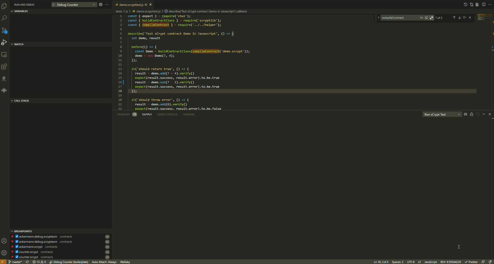
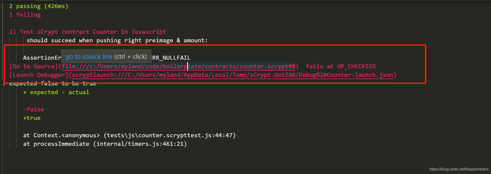
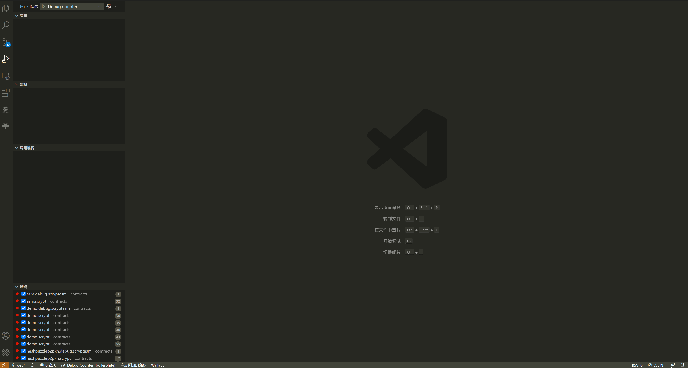

.. _testting:

===========================================
单元测试
===========================================

我们通过编写 **javascript/typescript** 来测试合约。`样板项目`_ 中有很多合约的测试用例。

首先，在工程根目录下运行 ``npm init`` 来创建一个 **npm** 项目。接下来安装依赖：

1. 安装 **scryptlib**

``npm i scryptlib``

.. hint::

    `scryptlib`_ 是官方提供的用于集成以 **sCrypt** 语言编写的比特币智能合约的 Javascript/TypeScript SDK。   

1. 安装 **mocha** 测试框架

``npm i -D chai mocha``

.. hint::

    我们推荐使用 `mocha`_ 测试框架来进行合约的测试，当然您可以使用其它测试框架。

3. 在 ``package.json`` 中配置测试命令 
    
``package.json`` 文件的脚本部分中应该存在一个名为 ``single-test`` 的脚本。**IDE** 用它来运行单个文件测试。通常它看起来像 "single-test": "mocha"，但您可以自定义它。

.. code-block:: console

    {
        "name": "helloworld",
        "version": "1.0.0",
        "description": "",
        "main": "index.js",
        "scripts": {
            "test": "mocha -r ts-node/register tests/**/*scrypttest.*  --reporter spec --timeout 600000",
            "single-test": "mocha --reporter spec --timeout 120000" //测试命令
        },
        "author": "",
        "license": "ISC",
        "dependencies": {
            "scryptlib": "^0.3.10"
        },
        "devDependencies": {
            "chai": "^4.3.4",
            "mocha": "^8.4.0"
        }
    }

**IDE** 支持在代码编辑器/资源管理器上下文菜单中运行单元测试文件。开始运行后，**IDE** 会为你自动打开VS Code底部面板，并显示 **输出** 视图，
测试报告将输出到 **输出** 面板。

.. note::

    测试文件必须以 ``.scrypttest.js`` 或 ``.scrypttest.ts`` 为后缀，否则菜单中不会出现“Run sCrypt Test”选项。

1. 测试合约时，您可以使用加载编译输出的 **合约描述文件** （也是就 * *_desc.json* 文件）比如：

.. code-block:: javascript

    const MyContract = buildContractClass(JSON.parse(descFileContent));

也可以使用 **scryptlib** 导出 ``compileContract`` 或者 ``compile`` 函数来编译合约。

.. code-block:: javascript

    const MyContract = buildContractClass(compileContract('demo.scrypt'));

1. 创建合约的实例

.. code-block:: javascript

    const instance = new MyContract(1234, true, ...parameters);

1. 执行合约的 *public* 函数来验证合约的正确性。

.. code-block:: javascript

    const funcCall = instance.someFunc(new Sig('0123456'), new Bytes('aa11ff'), ...parameters);
    const result = funcCall.verify(context);
    expect(result.success, result.error).to.be.true;

如何快速调试单元测试错误
================================

**IDE** 允许在单元测试失败的地方启动调试器，这将帮助开发人员极大地提高调试合约问题的效率。如果单元测试失败，则错误消息中还有另外两行信息：

**Go to Source** : 它显示了单元测试具体在合约代码中哪一行失败，以及最后执行的脚本操作码。**CRTL + 单击** 将直接跳转到发生错误行；

**Launch Debugger** : **CRTL + 单击** 链接将根据测试中的参数直接启动调试器会话。调试器将在错误即将发生之前暂停，以便检查导致故障的原因。利用这个功能可以极大提升 debug 的效率。

Launch Debugger 命令
================================

通常情况下，可使用右键菜单来运行单元测试，这样可以从 **输出** 中单击测试报告中的链接来打开调试器。 但是某些情况下，测试在外部环境运行，比如终端。
这种情况您将无法通过单击测试报告中的链接来打开调试器。这个时候，可以使用 **Launch Debugger** 命令，将 ``scryptlaunch:///{file}`` 粘贴到命令的输入弹出框中，并按 **Enter** 来启动调试器。

.. note::

    即使即将调试的合约不在当前项目中，也可以启动调试器

.. _scryptlib: https://github.com/sCrypt-Inc/scryptlib
.. _mocha: https://mochajs.org
.. _样板项目: https://github.com/sCrypt-Inc/boilerplate/tree/master/tests
.. _Boilerplate: https://github.com/sCrypt-Inc/boilerplate/tree/master/tests

