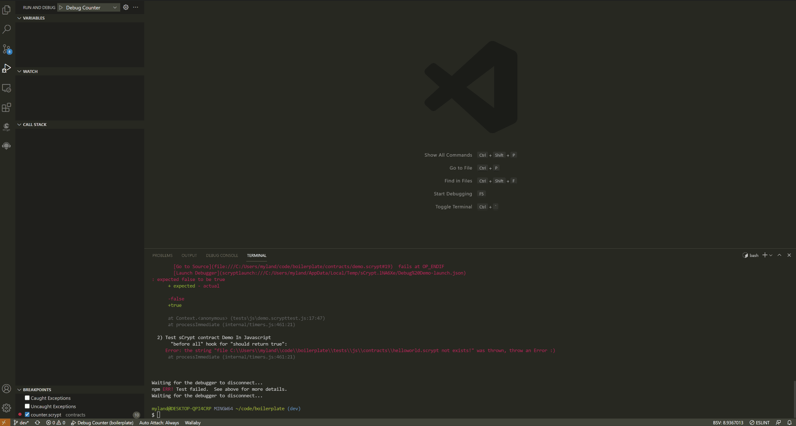

.. _testting:

===========================================
单元测试
===========================================

我们通过编写 **javascript/typescript** 来测试合约。我们推荐使用 `mocha <https://mochajs.org/>`_ 测试框架来进行合约的测试，当然您可以使用其它测试框架。
``package.json`` 文件的脚本部分中应该存在一个名为 ``single-test`` 的脚本。**sCrypt IDE** 用它来运行单个文件测试。通常它看起来像 "single-test": "mocha"，但您可以自定义它。

**sCrypt IDE** 支持在代码编辑器/资源管理器上下文菜单中运行单元测试文件。开始运行后，**sCrypt IDE** 会为您自动打开 VS Code 底部面板，并显示 **输出** 视图，
测试报告将输出到 **输出** 视图。

.. note::

    测试文件必须以 ``.scrypttest.js`` 或 ``.scrypttest.ts`` 为后缀，否则菜单中不会出现“Run sCrypt Test”选项。

1. 测试合约时，您可以使用加载编译输出的 **合约描述文件** （也是就 * *_desc.json* 文件）比如：

.. code-block:: javascript

    const MyContract = buildContractClass(JSON.parse(descFileContent));

也可以使用 **scryptlib** 导出 ``compileContract`` 或者 ``compile`` 函数来编译合约，用于集成和测试以 **sCrypt** 语言编写的比特币智能合约的 Javascript/TypeScript SDK

.. code-block:: javascript

    const MyContract = buildContractClass(compileContract('demo.scrypt'));

#. 创建合约的实例

.. code-block:: javascript

    const instance = new MyContract(1234, true, ...parameters);

#. 执行合约的 ``public`` 方法来验证合约的正确性。

.. code-block:: javascript

    const funcCall = instance.someFunc(new Sig('0123456'), new Bytes('aa11ff'), ...parameters);
    const result = funcCall.verify(context);

您可以参阅 `scryptlib <https://github.com/sCrypt-Inc/scryptlib>`_ 的文档以进步了解如何使用它。

如何快速调试 sCrypt 单元测试错误
================================

**sCrypt IDE** 允许您在单元测试失败的地方启动调试器，这将帮助开发人员极大地提高调试合约问题的效率。如果单元测试失败，则错误消息中还有另外两行信息：

.. image:: ./images/testting_fail.png
  :width: 100%

**Go to Source** : 它显示了单元测试具体在 **sCrypt** 合约代码中哪一行失败，以及最后执行的脚本操作码。**CRTL + 单击** 将直接跳转到发生错误行；

**Launch Debugger** : **CRTL + 单击** 链接将根据测试中的参数直接启动调试器会话。调试器将在错误即将发生之前暂停，以便检查导致故障的原因。利用这个功能可以极大提升 debug 的效率。

Launch Debugger 命令
================================

通常情况下，您使用右键菜单来运行单元测试，这样您可以从 **输出** 中单击测试报告中的链接来打开调试器， 但是某些情况下，您可能是在外部环境运行测试，比如终端，
这种情况您将无法通过单击测试报告中的链接来打开调试器，这个时候，您可以使用 **Launch Debugger** 命令，将 ``scryptlaunch:///{file}`` 粘贴到命令的输入弹出框中，并按 **Enter** 来启动调试器。

.. note::

    即使即将调试的合约不在当前项目中，也可以启动调试器

